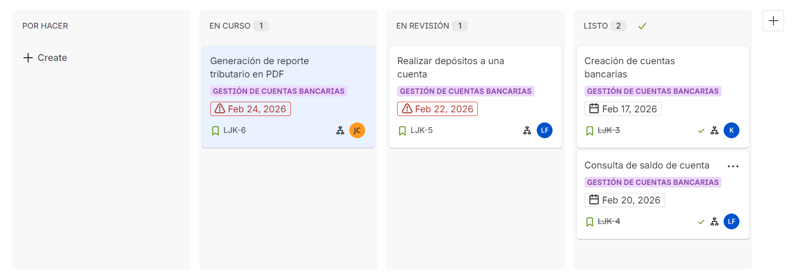

# Jira - Sprint Backlog

## 1. Historias de usuario seleccionadas para el primer sprint

Para el **Sprint 1** se seleccionaron las siguientes historias del board:

- **LJK-3:** Creación de cuentas bancarias.
- **LJK-4:** Consulta de saldo de cuenta.
- **LJK-5:** Realizar depósitos a una cuenta.
- **LJK-6:** Generación de reporte tributario en PDF.

## 2. Asignación de responsables por tarea

| Historia | Tarea principal | Responsable |
|----------|------------------|-------------|
| LJK-3 | Diseño e implementación de creación de cuentas bancarias | Kevin Cuitiva |
| LJK-4 | Implementación de consulta de saldo y validaciones | Laura Castillo |
| LJK-5 | Implementación de flujo de depósitos y registro de transacciones | Juan Silva |
| LJK-6 | Implementación de generación de reporte tributario en PDF | Laura Castillo |

## 3. Captura del Sprint Backlog en Jira

## 4. Justificación de la planeación

La planeación del sprint se definió priorizando primero funcionalidades de negocio directo para el usuario final y flujo transaccional básico del sistema bancario.

1. **LJK-3 y LJK-4** se marcan como base funcional porque permiten crear cuentas válidas y consultar estado/saldo.
2. **LJK-5** depende de la existencia de cuentas y de las validaciones previas, por eso se planifica después de las bases.
3. **LJK-6** tiene mayor riesgo técnico por su integración con generación de PDF, por lo que se deja como actividad en curso para estabilización en el siguiente ciclo.

Esta distribución permite entregar valor temprano, reducir riesgo técnico progresivamente y mantener trazabilidad entre backlog, capacidad del equipo y estado real en Jira.
