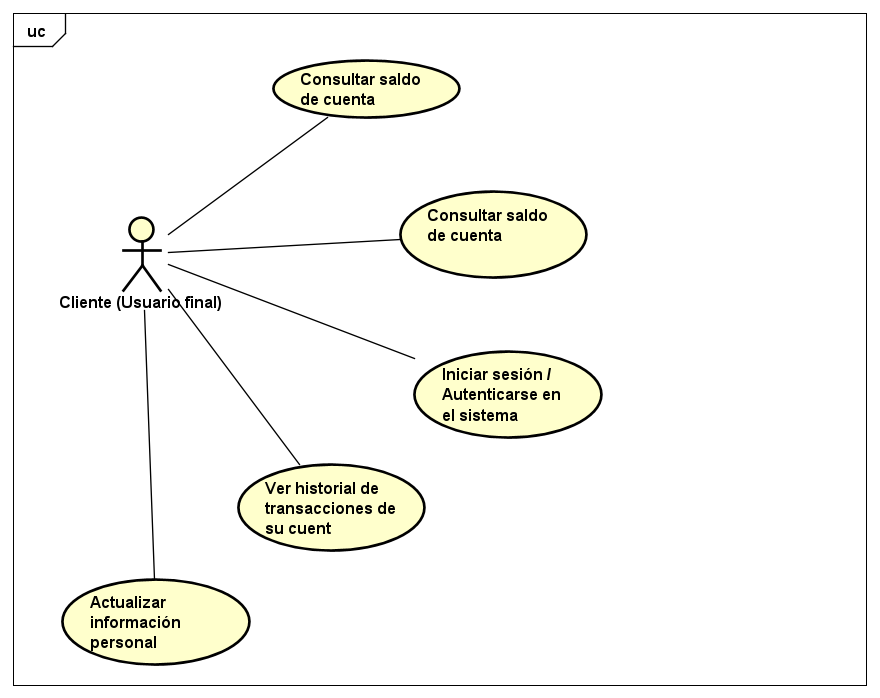
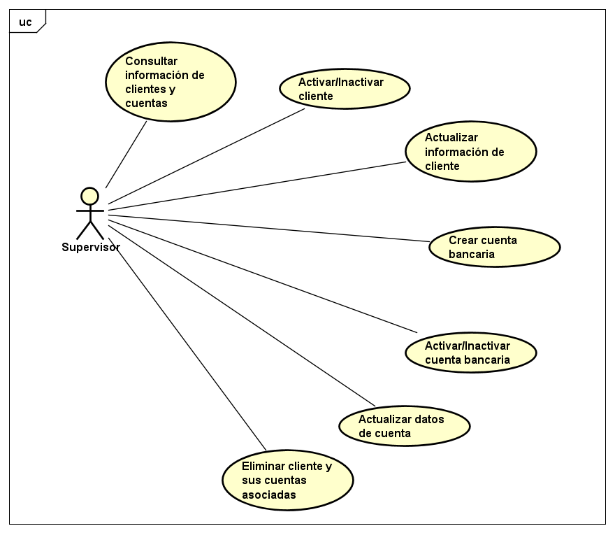
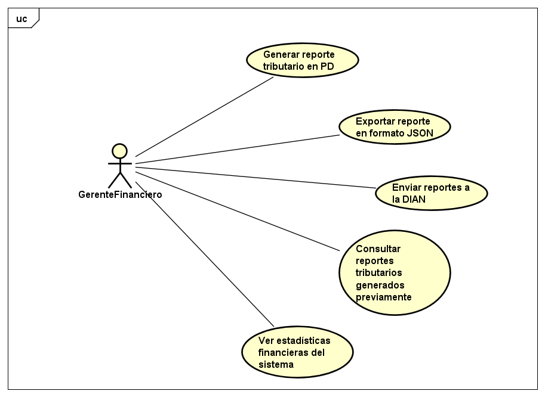

# 📄 Requerimientos del Sistema

## 1. Lista general de requerimientos
El sistema de Bankify tiene los siguientes requerimientos (descripción a alto nivel):

### 1.1 Requerimientos funcionales
El sistema de Bankify debe tener la capacidad de:

1. Autenticar usuarios con usuario y contraseña para operadores y clientes.
2. Gestionar clientes: crear, activar, inactivar, actualizar y eliminar información por roles autorizados.
3. Gestionar cuentas bancarias: crear, activar, inactivar, actualizar y validar número de cuenta y banco asociado.
4. Consultar saldo de cuentas por parte del cliente.
5. Realizar depósitos a una cuenta por parte del cliente u otros usuarios.
6. Generar reportes tributarios en PDF para clientes.
7. Exportar reportes en formato JSON para integración con DIAN.
8. Validar que los números de cuenta tengan exactamente 10 dígitos y pertenezcan a un banco registrado.

### 1.2 Requerimientos no funcionales
El sistema de Bankify debe tener:

1. Seguridad: Control de acceso basado en roles (clientes, operadores, gerentes).
2. Validación: Los números de cuenta deben cumplir formato de 10 dígitos numéricos.
3. Integridad: Los dos primeros dígitos del número de cuenta representan el banco asociado.
4. Disponibilidad: Capacidad para consultar saldos y realizar depósitos de forma confiable.
5. Interoperabilidad: Exportación de datos en formatos estándar (PDF, JSON) para sistemas externos.

## 2. Diagramas de caso de uso

### 2.1 Requerimiento Funcional 1

| Campo | Descripción |
|-------|-------------|
| ID | RF-01 |
| Nombre del requerimiento | Consultar saldo de cuenta |
| Descripción | El sistema debe permitir a los usuarios finales consultar el saldo disponible de sus cuentas bancarias registradas. |
| Precondiciones | Para que el sistema cumpla con este requerimiento, Bankify debe tener previamente:   - Usuario autenticado en el sistema.   - Cuenta bancaria registrada y activa.   - Número de cuenta válido (10 dígitos, banco registrado). |
| Actor | Usuario final (Cliente del sistema Bankify) |
| Flujo principal | 1. El usuario final inicia sesión en el sistema.   2. El sistema valida las credenciales del usuario.   3. El usuario selecciona la opción de consultar saldo e ingresa el número de cuenta.   4. El sistema valida que la cuenta existe, está activa y pertenece al usuario.   5. El sistema muestra el saldo actual de la cuenta. |
| Diagrama de caso de uso |  |
| Poscondiciones | Se espera como resultado que el usuario visualice el saldo de su cuenta sin realizar ninguna modificación en el sistema. |

### 2.2 Requerimiento Funcional 2

| Campo | Descripción |
|-------|-------------|
| ID | RF-02 |
| Nombre del requerimiento | Realizar depósito en cuenta |
| Descripción | El sistema debe permitir realizar depósitos de dinero a cuentas bancarias de forma controlada, validando datos de entrada y actualizando el saldo. |
| Precondiciones | Para que el sistema cumpla con este requerimiento, Bankify debe tener previamente:   - Usuario autenticado (cliente u operador).   - Cuenta bancaria destino registrada y activa.   - Número de cuenta válido (10 dígitos, banco registrado).   - Monto a depositar mayor a cero. |
| Actor | Usuario final, Operador / Supervisor |
| Flujo principal | 1. El actor inicia sesión en el sistema.   2. El actor selecciona la opción de realizar depósito.   3. El actor ingresa el número de cuenta destino y el monto a depositar.   4. El sistema valida que la cuenta existe, está activa y que el monto es válido.   5. El sistema registra la transacción y actualiza el saldo de la cuenta.   6. El sistema confirma el depósito exitoso al actor. |
| Diagrama de caso de uso |     |
| Poscondiciones | Se espera como resultado que el saldo de la cuenta destino se incremente en el monto depositado y que la transacción quede registrada en el sistema. |

### 2.3 Requerimiento Funcional 3

| Campo | Descripción |
|-------|-------------|
| ID | RF-03 |
| Nombre del requerimiento | Generar y enviar reportes tributarios |
| Descripción | El sistema debe permitir a gerentes financieros generar reportes tributarios en PDF para clientes y exportarlos en JSON para envío a la DIAN. |
| Precondiciones | Para que el sistema cumpla con este requerimiento, Bankify debe tener previamente:   - Gerente financiero autenticado con permisos para generar reportes.   - Datos de transacciones y cuentas registrados en el sistema.   - Integración configurada con el servicio de generación de PDFs.   - Endpoint de la DIAN configurado para recibir reportes. |
| Actor | Gerente financiero |
| Flujo principal | 1. El gerente financiero inicia sesión en el sistema.   2. El gerente selecciona la opción de generar reporte tributario.   3. El sistema recopila los datos de transacciones del período solicitado.   4. El sistema genera el reporte en formato PDF utilizando el servicio externo.   5. El sistema exporta el reporte en formato JSON.   6. El sistema envía el reporte JSON al servicio de la DIAN.   7. El sistema confirma la generación y envío exitoso del reporte. |
| Diagrama de caso de uso |  |
| Poscondiciones | Se espera como resultado que el reporte tributario esté disponible en PDF para el cliente y que el reporte JSON haya sido enviado exitosamente a la DIAN. |

## 3. Preguntas

### a. ¿Identifica algún requerimiento que deba detallarse más? ¿cuál(es)?

Sí, los siguientes requerimientos necesitan mayor detalle:

1. **RF-01 (Consultar saldo de cuenta)**: No especifica si el usuario puede consultar saldos de cuentas de otros usuarios o solo las propias. Debería aclararse que un cliente solo puede consultar sus cuentas asociadas.

2. **RF-02 (Realizar depósito)**: Falta definir límites de monto (mínimo/máximo), frecuencia de depósitos permitidos, y si se requiere algún tipo de validación adicional (ej. verificación en dos pasos para montos altos).

3. **RF-03 (Generar reportes tributarios)**: No especifica el período de tiempo que debe cubrir el reporte (mensual, trimestral, anual), ni qué información específica debe incluirse en el PDF y JSON. También falta detallar el formato exacto del JSON que espera la DIAN.

4. **Autenticación (RF-01 implícito)**: No se especifica el mecanismo de autenticación (tokens, sesiones), tiempo de expiración de sesión, ni políticas de contraseñas.

5. **Validación de banco**: Los dos primeros dígitos representan el banco, pero no se define dónde se almacena el catálogo de bancos válidos ni cómo se mantiene actualizado.

### b. ¿Existen requerimientos que se contradigan entre sí? ¿cuál(es)?

No se identifican contradicciones directas entre los requerimientos funcionales listados. Sin embargo, existe una **ambigüedad potencial**:

- **RF-02 vs Reglas de Negocio**: El RF-02 permite que "clientes u otros usuarios" realicen depósitos, pero no queda claro si un cliente puede depositar a la cuenta de otro cliente sin restricciones, lo que podría entrar en conflicto con políticas de seguridad implícitas.

- **Alcance del sistema**: En la sección 4.1 del scope.md se menciona "Eliminar un cliente y las cuentas asociadas cuando aplique", pero no hay un requerimiento funcional específico (RF-XX) que detalle este caso de uso, lo que genera inconsistencia entre el alcance declarado y los casos de uso documentados.

### c. Si tuviera que dar una prioridad a los requerimientos, ¿cuáles deberían ser los 2 más importantes que deberían implementarse en una primera iteración del proyecto?

Los 2 requerimientos más importantes para la primera iteración son:

1. **RF-01: Consultar saldo de cuenta** - Es la funcionalidad básica y más común que los usuarios esperan de un sistema bancario. No tiene dependencias complejas con sistemas externos y permite validar la arquitectura base del sistema.

2. **RF-02: Realizar depósito en cuenta** - Complementa el RF-01 y permite demostrar transacciones completas (lectura y escritura). Es fundamental para probar la integridad de datos, validaciones de negocio, y manejo de concurrencia.

**Justificación**: Estos dos requerimientos forman el flujo básico de un sistema bancario (consultar y depositar), tienen menor complejidad técnica que RF-03 (que depende de servicios externos como generación de PDF y DIAN), y permiten obtener feedback temprano de usuarios para validar el modelo de datos y la arquitectura antes de escalar a funcionalidades más complejas.

### d. ¿Existe algún requerimiento que no debería realizarse?

Considerando el **alcance declarado** y el objetivo de "crear una versión inicial", el siguiente requerimiento podría ser cuestionable:

**RF-03 (Generar y enviar reportes tributarios a la DIAN)** - Aunque está dentro del alcance, este requerimiento:

- Introduce **dependencias con sistemas externos** (servicio de PDFs y endpoint DIAN) que pueden no estar disponibles en etapas iniciales.
- Requiere conocimiento especializado de **normas tributarias** y formatos específicos de la DIAN que pueden cambiar.
- Agrega **complejidad de integración** que puede retrasar el MVP (Minimum Viable Product).

**Recomendación**: En lugar de eliminarlo completamente, se sugiere **posponer** RF-03 para una segunda iteración o simplificarlo inicialmente a solo "generar reporte básico en formato local" sin la integración con DIAN, permitiendo validar primero las funcionalidades core del sistema bancario.
