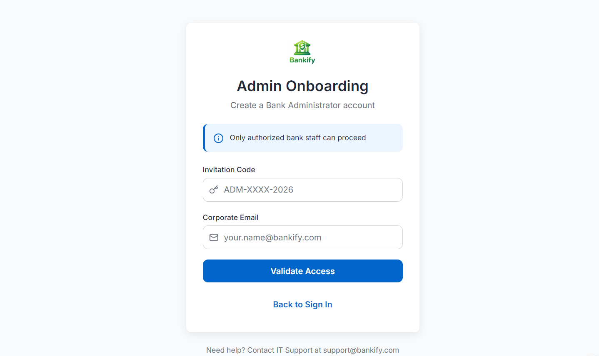
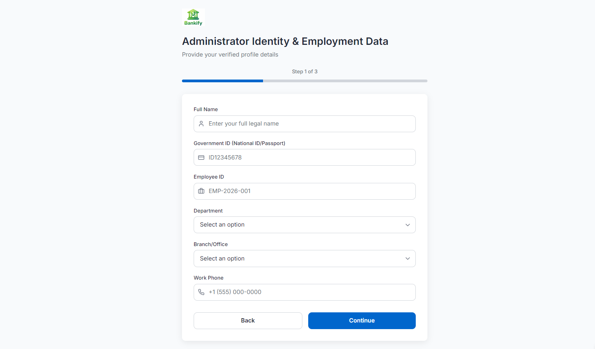
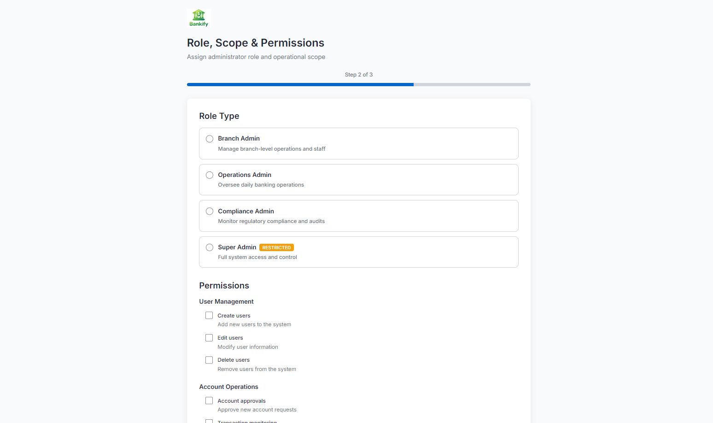
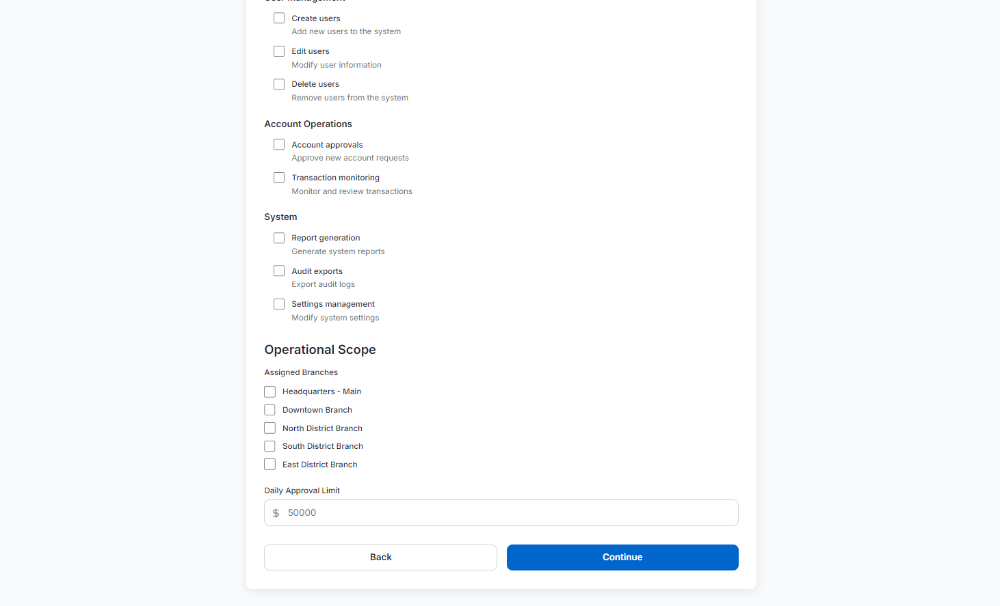
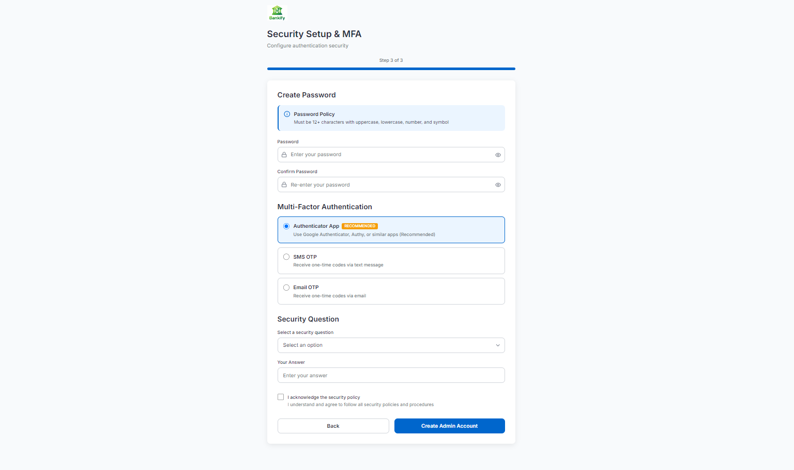
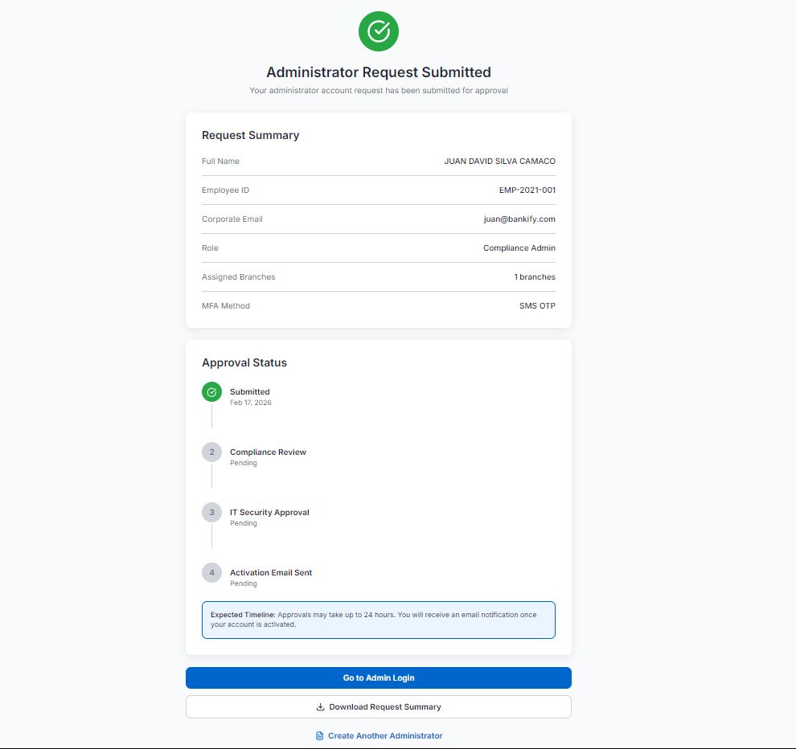

# Requerimientos del Sistema 

## 1. Sistema

- **Nombre del sistema:** Bankify
- **Objetivo:** Proveer un sistema básico para la gestión de cuentas bancarias que permita a clientes finales consultar saldos, realizar depósitos y generar reportes tributarios; además centralizar evidencias y documentación del laboratorio.

## 2. Problema a resolver

Actualmente Bankify no cuenta con un sistema centralizado que permita:

- Registrar cuentas bancarias de manera validada.
- Consultar el saldo de una cuenta.
- Realizar depósitos de dinero de forma controlada.
- Generar reportes tributarios en PDF para clientes.
- Enviar reportes a la DIAN.

El objetivo es crear una versión inicial que cumpla las reglas de negocio básicas y permita validar el modelo antes de escalar a funcionalidades más complejas.

## Reglas de negocio generales

- Los números de cuenta deben tener exactamente 10 dígitos; solo números, sin caracteres especiales.
- Los dos primeros dígitos del número de cuenta representan el banco (ej.: `01` -> Bancolombia, `02` -> Davivienda).
- Una cuenta solo es válida si pertenece a un banco registrado en el sistema.

## 3. Diagrama de contexto

### 3.1 Diagrama

Figura: Diagrama de contexto del sistema (archivo: `docs/uml/Diagrama de Contexto.png`).

### 3.2 Actores

| Actor / Rol | Descripción |
|-------------|-------------|
| Usuario final | Cliente del sistema Bankify que consulta saldos y realiza depósitos. |
| Operador / Supervisor | Personal autorizado para gestionar clientes y cuentas. |
| Gerente financiero | Genera y envía reportes tributarios para la DIAN. |

### 3.3 Sistemas externos

| Sistema | Descripción |
|--------:|-------------|
| Repositorio GitHub | Aloja el código fuente y artefactos del proyecto. |
| Servicio de CI  | Ejecuta compilaciones y pruebas automatizadas. |
| Servicio de generación de PDFs | Produce reportes tributarios en PDF para clientes. |
| Servicio DIAN  | Endpoint al que se envían reportes tributarios. |

## 4. Alcance del sistema

### 4.1 Dentro del sistema (Funciones que el sistema SÍ realiza)

1. Autenticación con usuario y contraseña para operadores y clientes.
2. Gestión de clientes: crear, activar, inactivar y actualizar información por roles autorizados.
3. Gestión de cuentas: crear, activar, inactivar y actualizar cuentas bancarias; validar número de cuenta y banco asociado.
4. Consultar saldo de cuentas por parte del cliente.
5. Realizar depósitos a una cuenta por parte del cliente u otros usuarios.
6. Generar reportes tributarios en PDF para clientes.
7. Exportar reportes en formato JSON para integración con DIAN.
8. Eliminar un cliente y las cuentas asociadas cuando aplique.

### 4.2 Fuera del sistema (Funciones que NO realiza)

1. No gestiona infraestructura de despliegue en producción (p. ej. provisioning en la nube).
2. No procesa pasarelas de pago externas ni conciliaciones avanzadas.
3. No gestiona notificaciones masivas (solo soporte para exportar datos a servicios externos).

**Autor:** Juan Silva, Laura Castillo, Kevin Cuitiva
**Fecha:** 2026-02-14

## 5. Parte 4 - Mockups y flujos de navegación

### 5.1 Requerimiento funcional seleccionado

Se seleccionó el requerimiento de **creación de cuenta de Administrador del banco** dentro del sistema Bankify.

Este flujo contempla:

- Validación de acceso administrativo.
- Registro de datos personales y laborales del administrador.
- Configuración de rol y permisos.
- Configuración de seguridad (contraseña y MFA).
- Confirmación y estado de aprobación de la solicitud.

### 5.2 Mockups implementados (Figma)

1. **Pantalla 1 - Secure Admin Access Entry**  
	

2. **Pantalla 2 - Administrator Identity & Employment Data**  
	

3. **Pantalla 3 - Role, Scope & Permissions (parte 1)**  
	

4. **Pantalla 3 - Role, Scope & Permissions (parte 2)**  
	

5. **Pantalla 4 - Security Setup & MFA**  
	

6. **Pantalla 5 - Review, Approval Status & Activation**  
	

> Nota: la pantalla 3 se dividió en `3.1` y `3.2` para mejorar legibilidad por tamaño del diseño original.

### 5.3 Flujo de navegación definido

1. **Pantalla 1 -> Pantalla 2**: validación de código de invitación y correo corporativo.
2. **Pantalla 2 -> Pantalla 3 (3.1 / 3.2)**: captura de identidad y datos laborales.
3. **Pantalla 3 -> Pantalla 4**: asignación de rol, alcance y permisos administrativos.
4. **Pantalla 4 -> Pantalla 5**: configuración de seguridad, MFA y envío de solicitud.
5. **Pantalla 5**: visualización de estado de aprobación y activación de cuenta de administrador.

### 5.4 Criterios cumplidos de la Parte 4

- Se diseñaron entre 3 y 5 pantallas funcionales (5 pantallas, con una dividida en 2 imágenes por tamaño).
- Se incluyó identidad visual de Bankify (logo y estilo de marca).
- Se especificó el flujo principal de navegación entre pantallas.
- El diseño se alineó al requerimiento funcional seleccionado.

